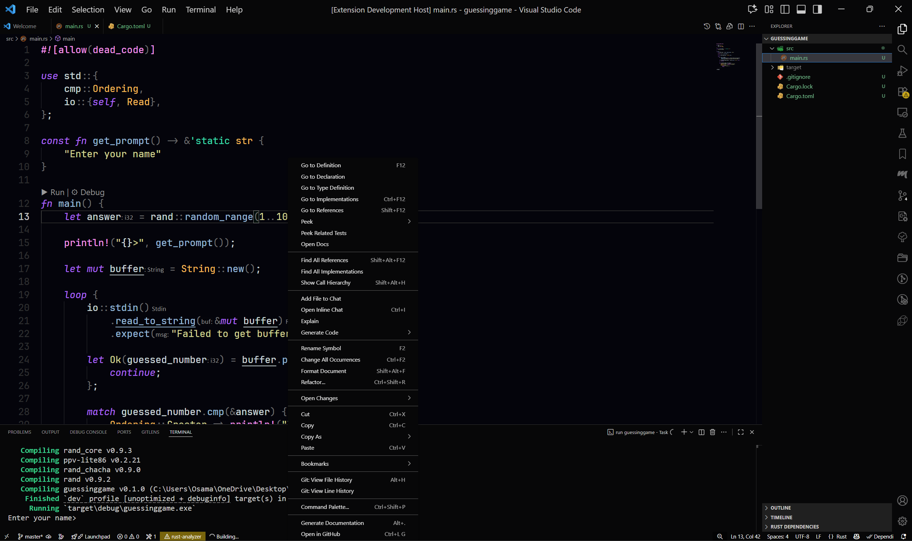

# Ironsand README

Simple Pitch-Dark theme for Rust which has

- Highlighting mutability
- Highlighting macros and attributes
- Highlighting unsafe blocks and calls
- Highlighting lifetime parameters and labels

